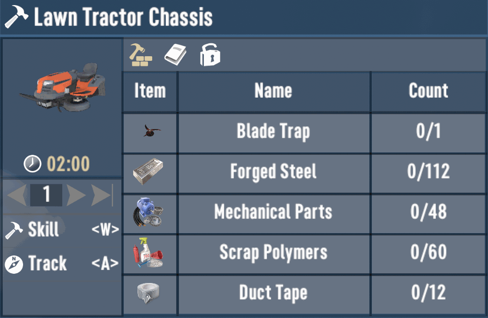
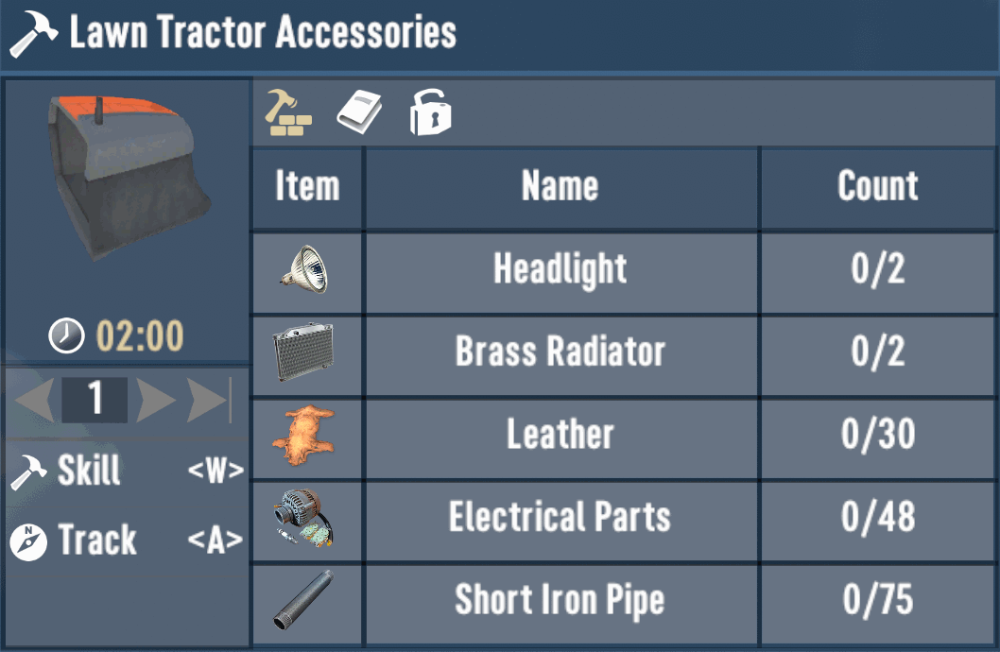
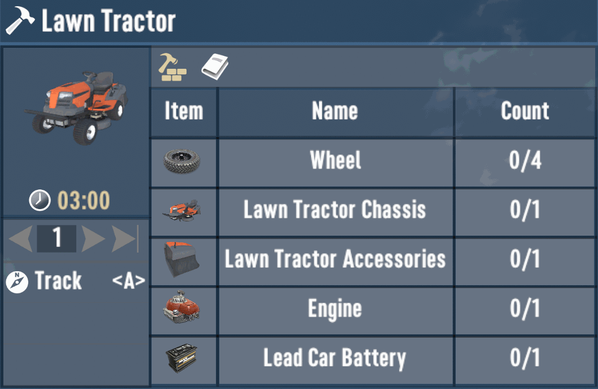
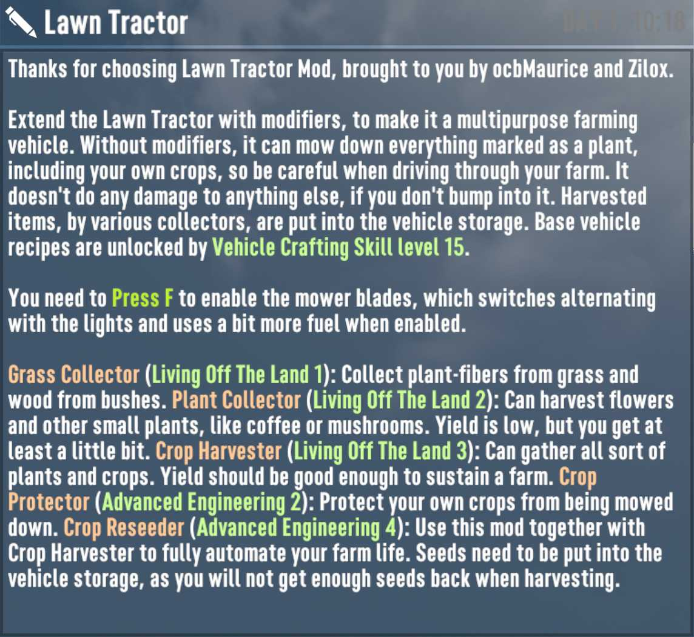
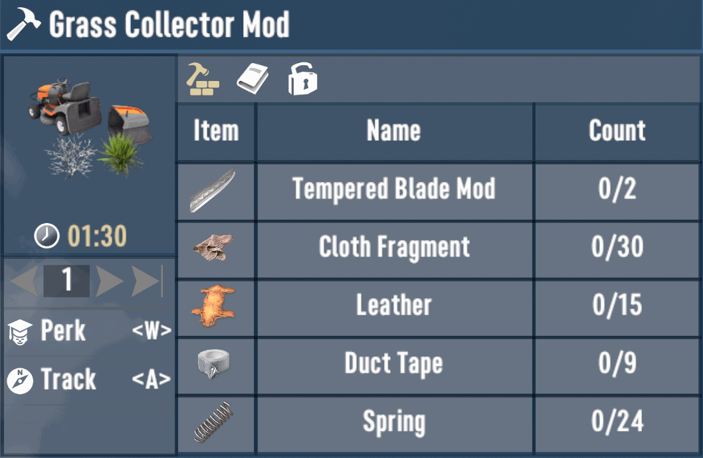
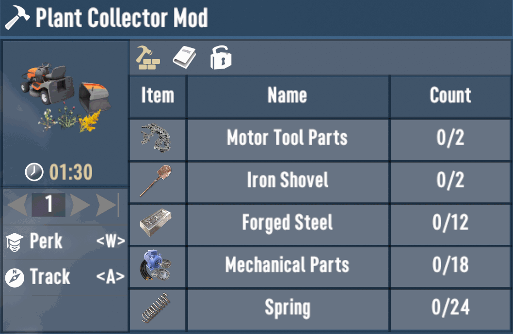
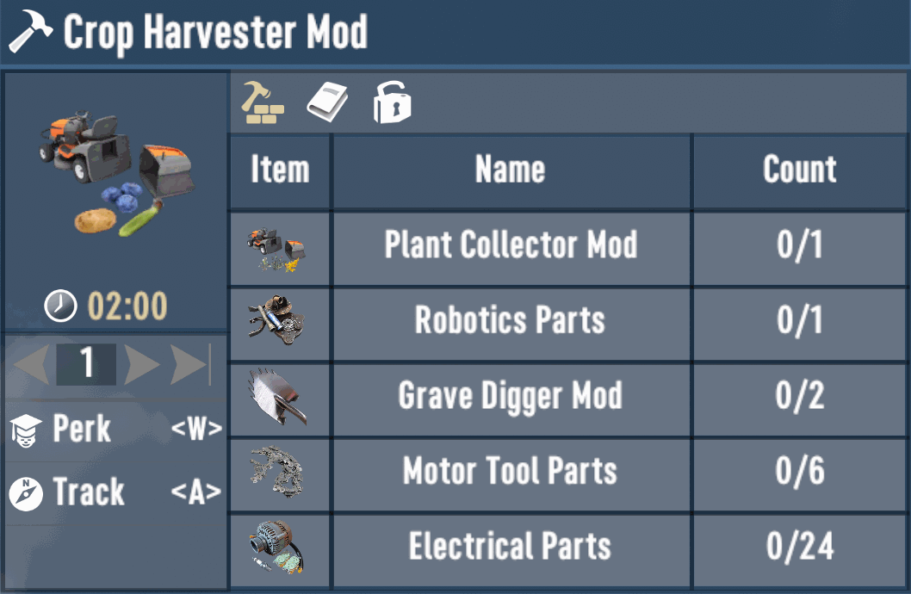
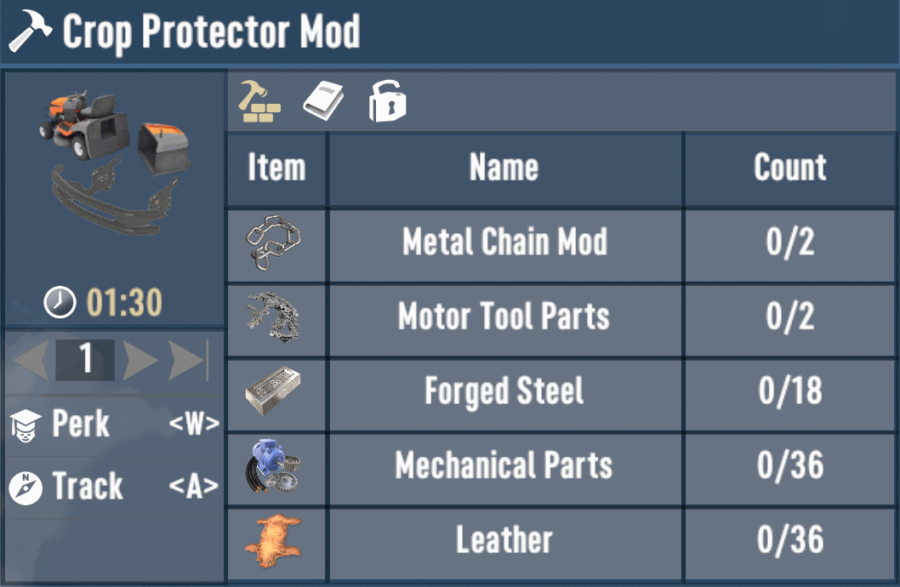
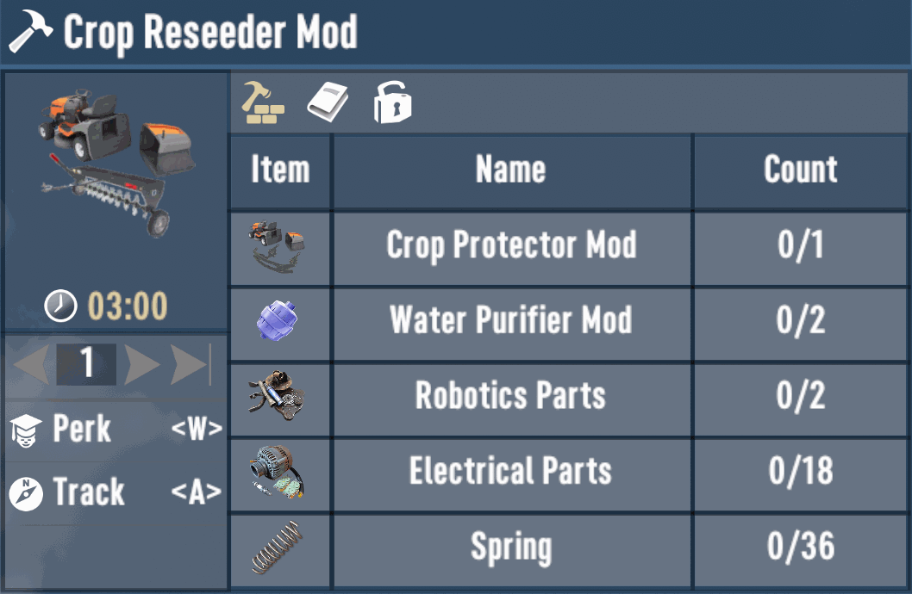

# Lawn Mowing Mod - 7 Days to Die (V1.0 exp) Addon

What started as a small Proof of concept has grown into a feature rich
Mod, that should satisfy a few of your farming sim desires. I've added
a few treats here and there to make it a better overall experience.

Needs to be installed client and server side. And both need EAC (Easy Anti-Cheat) to be
turned off! There is no server-side only version of this mod as it contains custom code.

Currently there is only the Ride-On Lawn Tractor Model from Zilox.
There might be more in the distant future, like a manual lawn mower.

Special Thanks to all the people that made this mod possible!

[![GitHub CI Compile Status][3]][2]

## Lawn Tractor

The required parts for the placeable vehicle are unlocked at Vehicle Crafting
Skill Level 15. In its base configuration, it can only remove grass and bushes,
but doesn't collect any items. You will need modifiers for advanced tasks.

Lawn Tractor with equipped Crop Protector and Collector:

## Copyright Notice

The assets used in this mod are paid and are not to be re-used under any circumstance
without you acquiring the proper licenses yourself. The unity models and textures are
only provided for educational purpose and for easier collaboration. These assets would
be included anyway in the final unity3d file. Please support and respect content creators.

- https://rescue3d.com/2020/12/30/riding-lawn-mower-low-poly-3d-model/
- https://www.soundjay.com/lawn-mower-sound-effect.html

### Toggling Lawn Tractor Features

In order to enable the mowing/harvesting, you have to press F. The function will toggle
alternating with the light, so to only toggle mowing/harvesting, press it twice.

### Lawn Tractor Recipes

### Journal Entry

Once you equip your first Lawn Mower, a journal entry will be added:

## Vehicle Modifiers

The Lawn Tractor has various modifiers to upgrade its capabilities.

### Grass Collector

This is the simplest modifier that you should be able to get quite early.
It will only collect items from grass and bushes, and the yield will be
significantly lower than when harvesting by hand/tool. You can get a fully
functional grass collector from harvesting pristine lawn tractors. Otherwise
you can find or buy the schematics, or unlock Living Off the Land Level 1.

### Plant Collector

With this modifier you will also harvest and collect items from various other
small plants, like cotton, coffee or mushrooms. Yield is also significantly
lower than when harvested by hand/tool. You can get a fully functional plant
collector from harvesting pristine lawn tractors. Otherwise you can find or
buy the schematics, or unlock Living Off the Land Level 2.

### Crop Harvester

Upgrade for the plant collector, that gives much better yield, a bit less when
harvested by hand/tool though. It should be able to collect every growing crop
and also gives seeds back. You can get a fully functional plant collector from
harvesting pristine lawn tractors. Otherwise you can find or buy the schematics,
or unlock Living Off the Land Level 3.

### Crop Protector

Basic mod that protects all player plants, so you don't have to worry that
you accidentally mow down your own plants when tiding up the surroundings.
You can get a fully functional plant collector from harvesting pristine
lawn tractors. Otherwise you can find or buy the schematics, or unlock
Advanced Engineering Level 2.

### Crop Reseeder

Upgrade for the crop protector, that will automatically reseed player plants
when harvesting. Seeds must be filled into the vehicle inventory, as you will
not get enough seeds back from harvesting mostly. Speed for harvesting and
reseeding has been limited to make it a bit more realistic and to make it
not too overpowered.

### Harvestable Prefabs

There are 3 different damage level variations of the Lawn Tractor, which all
come in 7 different colors, so 21 new randomly placed vehicles in the world.
They can all be harvested for parts and give the same resources as regular
cars, plus a few additional items. Pristine Lawn Tractors have a good chance
to drop either a fully functional modifier part or one of the other rare
resources you need to build the recipes. A damaged Lawn Tractor sill has
a small chance to give you a rare resource for the recipes, while a wrecked
vehicle will only give the usual scrap that cars would give you.

## Download and Install

End-Users are encouraged to download my mods from [NexusMods][4].  
Every download there helps me to buy stuff for mod development.

Otherwise please use one of the [official releases][1] here.  
Only clone or download the repo if you know what you do!

## Changelog

### Version 2.3.1

- Disable GetHitRootTransform patch

### Version 2.3.0

- First compatibility with V1.0 (exp)
- Refactor to allow to collect more blocks
- Enabled rocks and ember piles to be harvested
- Add gore collector mod to gather gore blocks
- Collecting these will damage the vehicle slightly

### Version 2.2.0

- Refactor passive effect for perk progression
- Refactor to allow mowing of any custom block

### Version 2.1.2

- Refactor Darkness Falls progression
- Customize Darkness Falls Journal entry

### Version 2.1.1

- First Darkness Falls A21 compatibility

### Version 2.1.0

- Update compatibility for 7D2D A21.0(b324)

### Version 2.0.5

- Add emission support for front and brake lights
- Lower spawn rate of vehicle in world substantially
- Add modern asset exporter and change format to LZ4
- First steps for Undead Legacy Compatibility (thx @Ivinedra)

### Version 2.0.4

- Fix regression with grass harvester not harvesting fibers  
  Done by fixing vanilla block extend code for harvest drops

### Version 2.0.3

- Change drop destroy to harvest, since it doesn't obey tags  
  Additional seeds for Harvester were also given on manual harvest
- Add automated translations for 27 languages via DeepL

### Version 2.0.2

- Add support for "FoodExpansion" mod  
  Harvest wheat, tomato, onion and cabbage crops  
  Plant Collector will only collect some Wheat

### Version 2.0.1

- Fixes dedicated server issues
- Adjust blade and reseed intervals

### Version 2.0.0

- Renames "Lawn Mower" to "Lawn Tractor" (more fitting by now)
- Lowers necessary Grease Monkey Level from 4 to 3 (same as minibike)
- Adds multiple item modifiers for advanced capabilities (see README).
- Adds harvestable prefab variants to spawn like other cars in the world.
- Adds Initial Darkness Falls compatibility (needs more testing).

### Version 1.0.0

- Initial working version

[1]: https://github.com/OCB7D2D/OcbLawnMowing/releases
[2]: https://github.com/OCB7D2D/OcbLawnMowing/actions/workflows/ci.yml
[3]: https://github.com/OCB7D2D/OcbLawnMowing/actions/workflows/ci.yml/badge.svg
[4]: https://www.nexusmods.com/7daystodie/mods/3312